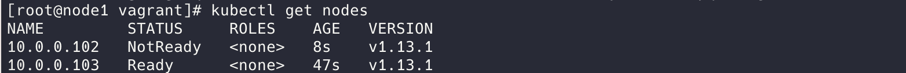

# k8s_cluster


## About

This project provides an easy way to create a basic Kubernetes cluster almost automatically on your local machine **within 3 steps**.

This project uses [Vagrant](https://www.vagrantup.com/) and [VirtualBox](https://www.virtualbox.org/) to batch create and destroy virtual machines conveniently.

## Requirements

* Vagrant 2.0.1 See https://www.vagrantup.com/ for more.
* VirtualBox 5.2.18 or above. See https://www.virtualbox.org/ for more.

## Usage

### Step1

Clone this project and execute `vagrant up`.
And this process may take a few minutes.

```bash
$ git clone https://github.com/kid1412z/k8s_cluster.git
$ cd k8s_cluster/
$ vagrant up
```


### Step2

SSH to the three nodes and execute `start.sh`
```bash
$ vagrant ssh node1
$ sudo sh /vagrant/start.sh
...
$ vagrant ssh node2
$ sudo sh /vagrant/start.sh
...
$ vagrant ssh node3
$ sudo sh /vagrant/start.sh
```

### Step3

Approve CSR on master node(node1).

```bash
$ kubectl get csr
$ kubectl kubectl certificate approve ${NAME_YOU_SEE_IN_THE_LIST}
...
```


Now you get a Kubernetes cluster on your machine! Enjoy!



## Cluster Detail

```
node1	10.0.0.101	k8s-master	etcd、kube-apiserver、kube-controller-manager、kube-scheduler
node2	10.0.0.102	k8s-node	etcd、kubelet、docker、kube_proxy
node3	10.0.0.103	k8s-node	etcd、kubelet、docker、kube_proxy
```

## Clean Up

This operation will destroy all your virtual machine nodes in cluster. And the data stored on nodes will be permanently removed. Please make sure you have saved the data.

```bash
$ cd cd k8s_cluster/
$ vagrant destroy
```

## Other

If you want to generate a new CA, see `config_ssl.sh`.

## Acknowledgement

Thanks to the project [https://github.com/minminmsn/k8s1.13](https://github.com/minminmsn/k8s1.13). It contains a very detailed and clear configuration instructions which helped a lot.

## Licence

[Apache License 2.0](https://github.com/kid1412z/k8s_cluster/blob/master/LICENSE)